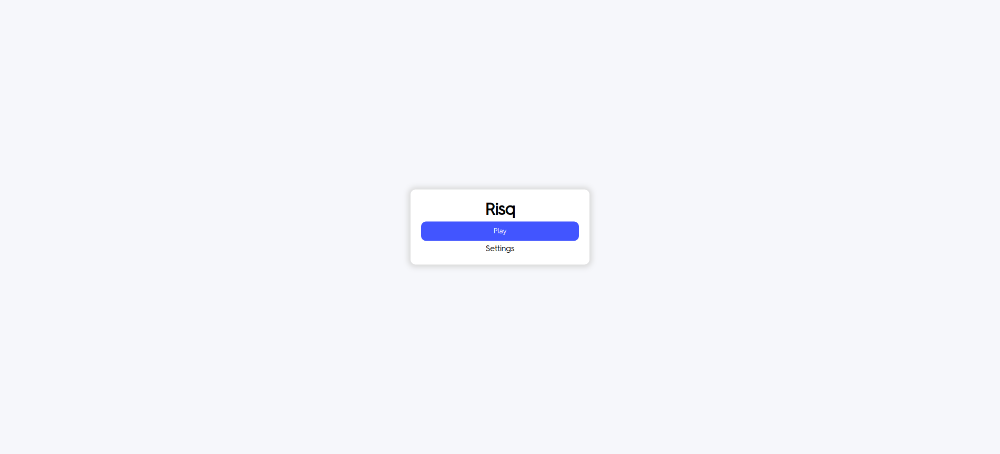

# How to Play Risq

Risq is the game to put your money where your mouth is. In the game, you accumulate points by risking the balance that you built up in the first stage. If, when betting, your point total reaches zero, the game is over.

To add a bit of variety to the game, there are two settings that enable 1) AI generated options and 2) an AI sentence phase. The first refers to the options in the mandatory first stage of the game, which resembles Quizlet Learn. The second refers to the optional AI sentence phase, where you write a sentence incorporating a given term that is graded by an AI.

In the traditional version of the game, there are two stages:

1. Multiple choice questions rewarding 1000 points
2. Free response questions with betting

In the AI Sentence version of the game, there are three stages:

1. Multiple choice questions rewarding 1000 points (same as above)
2. Sentence creation phase rewarding no points, but where you place a bet on your future ability to answer a fill-in-the-blank question that contains the word.
3. Fill-in-the-blank multiple-choice questions where points previously betted in stage 2 are either added or deducted.

Note - in this stage, you can only bet on the amount of points acquired in the first stage. Points do not accumulate between the questions you bet on.

## Adjusting Settings

To adjust settings, click "Settings" on the start page and edit the settings:

## Traditional

To play the traditional version of the game, make sure that "AI Sentence Phase" is unchecked in settings.

To start, click "Play":

Choose the word that best matches the definition:

If you get a question wrong, you will return to it without the opportunity to win 1000 points.

After answering all of the questions correctly in the first stage, you will move to the free-response phase.

Answer the prompt with the correct term and enter the amount you are willing to risq:

If you get a question wrong here, you will not have another chance to get it right. Once you have answered all of the questions, you will return to the start page, with your previous score being displayed:

## AI Sentences

To play the AI Sentence version of the game, make sure that "AI Sentence Phase" is checked in settings.

Follow the same steps as traditional to start the game. Only until the multiple choice are completed does it begin to differ.

In the second stage, create a sentence that uses the term. Make sure that the sentence makes sense given the word's definition. The AI will grade this:

After every term has been displayed, the next phase will ask you to fill in the blank where the term originally was in the sentence.

After all of the questions are answered, you have completed the game.

## Have fun!

Now that you know how to play the game, have fun with it! Use it to make studying even more engaging with Quizlet.
